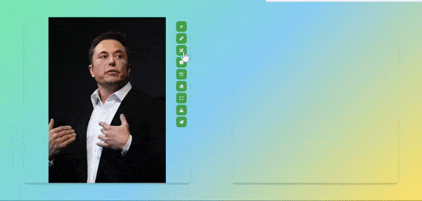

# AI_TryOn_mini


# Demo



# Tools

From top to bottom
- Clear image
- Drawer
- SAM point-segmenter with interactive functionality (left pos right neg)
- Rect-drawer for local area correction
- Undo
- Eraser
- Expand
- Download
- Send to render

# Colab Tutorial

Follow this [Colab example](script/AI_TryOn_mini.ipynb), or run on [Colab](https://colab.research.google.com/drive/1uWc59qcvgoLA1GCX5rdVbG5xz4MAK0SK?usp=drive_link). Need to register a ngrok account and copy your token to replace "{your_token}".

# Run Locally

- Install the dependencies (if needed)
```shell
pip install -r requirements.txt
```
- Download models of [SAM](https://github.com/facebookresearch/segment-anything), [LDM](https://github.com/CompVis/stable-diffusion), [ControlNet](https://github.com/lllyasviel/ControlNet), and [LoRA](https://github.com/microsoft/LoRA).

You may download models from [civitai](https://civitai.com/) or
```
./script/download.sh
```
or
```
. script/download.sh
```
where the model I downloaded from official sites and distributors on civitai. Thanks to them.
- Launch backend
```
python run_app.py
```
- Go to Browser
```
http://127.0.0.1:8001
```

# Hardware requirements

- At least 12G GPU memory is required

# TODO

- CodeFormer
- Memory optimization
- ...
